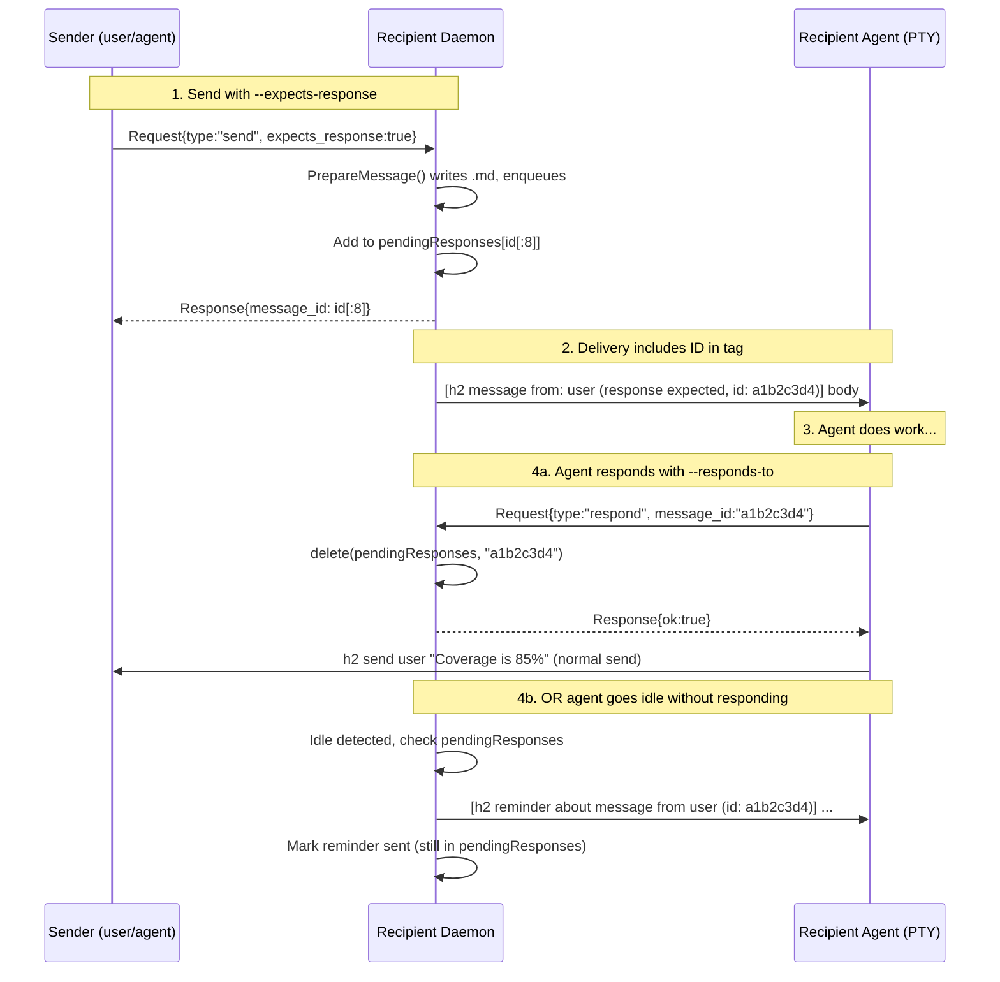
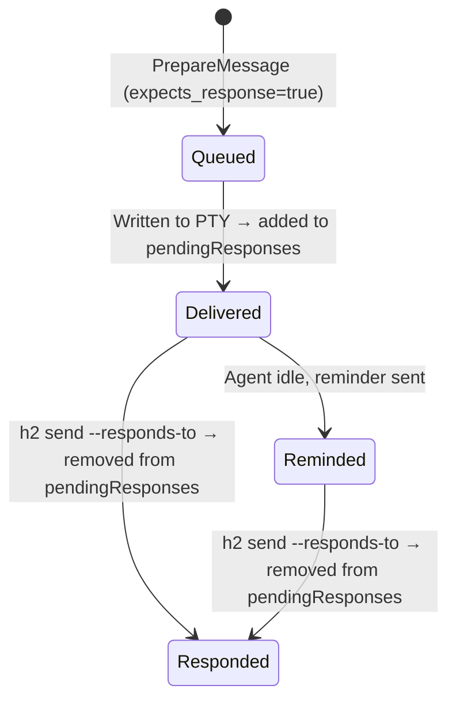

# Design: Expects-Response Message Tracking

## Summary

Add an opt-in protocol for h2 messages that tracks response obligations. When a
sender marks a message with `--expects-response`, the recipient agent is shown
the message ID and a tag indicating a response is expected. The recipient closes
the obligation with `--responds-to <id>` on a subsequent `h2 send`. If the agent
goes idle without having responded, the system injects a reminder before any
idle-queue messages are delivered.

The obligation lives entirely on the recipient's side. The sender fires and
forgets — it's the recipient's daemon that tracks whether a response is owed.

## User-Facing Interface

### Sending a message that expects a response

```
h2 send --expects-response scheduler "Can you check test coverage?"
```

Prints the message ID (8-char short ID from the on-disk filename) to stdout.

### Delivered message format (what the recipient agent sees)

Short body (inline):
```
[h2 message from: user (response expected, id: a1b2c3d4)] Can you check test coverage?
```

Long body (file reference):
```
[h2 message from: user (response expected, id: a1b2c3d4)] Read /path/to/file.md
```

The `(response expected, id: <id>)` annotation is only added when the message
has `ExpectsResponse` set. Normal messages remain unchanged.

### Responding to close the obligation

With a message body (sends the response AND closes the obligation):
```
h2 send --responds-to a1b2c3d4 user "Coverage is 85%"
```

Without a message body (just closes the obligation, sends nothing to the sender):
```
h2 send --responds-to a1b2c3d4 user
```

The body argument is normally required by `h2 send` but becomes optional when
`--responds-to` is set.

### Reminder format (injected at idle)

When the agent goes idle and has unresponded messages, a reminder is injected
into the PTY before any idle-queue messages:

```
[h2 reminder about message from scheduler (id: a1b2c3d4)] Respond with: h2 send --responds-to a1b2c3d4 scheduler "your response"
```

Reminders fire once per message. They are not repeated on subsequent idle cycles.

## Architecture

The message ID is the 8-char prefix already embedded in the on-disk message
filename (`<timestamp>-<id[:8]>.md`). This is derived from the UUID generated
in `PrepareMessage()`. No additional persistence is needed — the ID comes from
the filename, and response tracking is in-memory on the recipient's daemon.

The sender's process has no tracking responsibility. When user A sends
`--expects-response` to agent B, user A's process forgets about it. Agent B's
daemon owns the obligation from that point forward.





## Data Model Changes

### Message struct (`internal/session/message/message.go`)

Add one field to `Message`:

```go
type Message struct {
    // ... existing fields ...
    ExpectsResponse bool   // sender requested a response
}
```

### MessageQueue (`internal/session/message/queue.go`)

Add a dedicated tracking map for pending response obligations:

```go
type MessageQueue struct {
    // ... existing fields ...
    pendingResponses map[string]*Message  // keyed by 8-char short ID
}
```

This map is populated when an expects-response message is delivered (in
`deliver()` via a new callback or post-delivery hook). Entries are removed
when `MarkResponded()` is called. The reminder service iterates this map.

Each entry also carries a `reminderSent bool` to ensure reminders fire only
once. This can be tracked via a separate set or a wrapper struct:

```go
type pendingResponse struct {
    msg          *Message
    reminderSent bool
}
```

### Wire protocol (`internal/session/message/protocol.go`)

Add to `Request`:

```go
type Request struct {
    // ... existing fields ...

    // send fields (new)
    ExpectsResponse bool   `json:"expects_response,omitempty"`

    // respond fields (new request type: "respond")
    // Reuses existing MessageID field
}
```

Add `"respond"` as a valid `Type` value.

### MessageInfo (`internal/session/message/protocol.go`)

Add to `MessageInfo` for `h2 show`:

```go
type MessageInfo struct {
    // ... existing fields ...
    ExpectsResponse bool   `json:"expects_response,omitempty"`
    Responded       bool   `json:"responded,omitempty"`
}
```

## Implementation Details

### File-by-file changes

#### `internal/cmd/send.go`

- Add `--expects-response` bool flag
- Add `--responds-to` string flag (takes the 8-char message ID)
- When `--responds-to` is set, body becomes optional (skip the "message body
  is required" error)
- When `--responds-to` is set:
  1. Resolve self via `resolveActor()`
  2. Find own daemon socket via `socketdir.Find(self)`
  3. Send `Request{Type: "respond", MessageID: id}` to own daemon
  4. If body is non-empty, proceed to send message to target as normal
  5. If body is empty, done — obligation closed, nothing to deliver
- When `--expects-response` is set, include it in the send Request to the target
- Change stdout output: print the 8-char short ID (`resp.MessageID`) instead of
  full UUID (the response will now carry the short ID)

#### `internal/session/message/message.go`

- Add `ExpectsResponse bool` field to `Message` struct

#### `internal/session/message/protocol.go`

- Add `ExpectsResponse bool` to `Request`
- Add `ExpectsResponse`, `Responded` to `MessageInfo`

#### `internal/session/message/delivery.go`

**`PrepareMessage()`**:
- Accept new `expectsResponse bool` parameter
- Set `msg.ExpectsResponse = expectsResponse`
- Return `id[:8]` (the short ID) instead of the full UUID, since this is the
  canonical message ID for this feature and matches the filename

**`deliver()`**:
- When `msg.ExpectsResponse` is true, modify the format string to include the
  response-expected annotation with the short ID:
  ```go
  annotation := ""
  if msg.ExpectsResponse {
      annotation = fmt.Sprintf(" (response expected, id: %s)", msg.ID[:8])
  }
  line = fmt.Sprintf("[%s from: %s%s] %s", prefix, msg.From, annotation, body)
  ```
- After delivery, if `msg.ExpectsResponse`, call `cfg.Queue.AddPendingResponse(msg)`

**`RunDelivery()`**:
- Before the inner dequeue loop, when idle and not blocked, check for pending
  response reminders and deliver them before any idle-queue messages:
  ```go
  if idle && !blocked {
      for {
          reminder := cfg.Queue.NextReminder()
          if reminder == nil {
              break
          }
          deliver(cfg, reminder)
      }
  }
  ```

#### `internal/session/message/queue.go`

Initialize `pendingResponses` in `NewMessageQueue()`.

**New method `AddPendingResponse(msg *Message)`**:
- Under lock, add `msg` to `pendingResponses` keyed by `msg.ID[:8]`

**New method `NextReminder() *Message`**:
- Under lock, iterate `pendingResponses` for entries where `!reminderSent`
- For the first match, set `reminderSent = true`, construct and return a
  synthetic `Message` with:
  - `From`: `"h2-reminder"`
  - `Body`: `[h2 reminder about message from <from> (id: <shortID>)] Respond with: h2 send --responds-to <shortID> <from> "your response"`
  - `FilePath`: empty (always inline, never written to disk)
  - `Raw`: false
- Returns nil if no pending reminders

**New method `MarkResponded(shortID string) bool`**:
- Under lock, delete entry from `pendingResponses`
- Return whether it was found

#### `internal/session/listener.go`

**`handleConn()`**:
- Add `"respond"` case routing to new `handleRespond()` method

**New `handleRespond(conn, req)`**:
- Call `s.Queue.MarkResponded(req.MessageID)`
- Return success/failure response

**`handleSend()`**:
- Pass `req.ExpectsResponse` through to `PrepareMessage()`
- Return the short ID in `Response.MessageID`

**`handleShow()`**:
- Include `ExpectsResponse` in `MessageInfo`
- Include `Responded` (check if shortID is absent from `pendingResponses`)

### Edge cases

**Sender has no daemon socket** (e.g., user terminal, not an h2 agent): The
`--responds-to` send command will fail to find its own socket. This is fine —
warn and skip the respond step. The message to the target still sends. The
pending response just won't be cleared, but since the sender has no daemon,
there's no reminder service running either.

**Agent exits without responding**: If the agent went idle before exiting, the
reminder was sent. If it crashed without ever going idle, no reminder fires.
Acceptable — a crashed agent has bigger problems. The pending response state is
in-memory only and is lost on exit.

**Message ID collision**: The 8-char hex prefix gives ~4 billion values. For a
single agent's message set (typically dozens to hundreds), collision probability
is negligible.

**Multiple expects-response messages pending**: All fire reminders at idle,
delivered sequentially before any idle-queue messages.

**Responds-to with invalid/unknown ID**: `MarkResponded()` returns false,
`handleRespond()` returns an error response, `h2 send` prints the error and
exits non-zero. The message to the target (if body was provided) is NOT sent
— fail fast on invalid responds-to ID.

## Testing

### Unit tests

**`message/queue_test.go`**:
- `TestNextReminder_NoExpectsResponse` — returns nil when no messages expect response
- `TestNextReminder_NotDelivered` — returns nil for queued-but-undelivered expects-response messages
- `TestNextReminder_Delivered` — returns reminder for delivered expects-response message
- `TestNextReminder_AlreadyResponded` — returns nil when already responded
- `TestNextReminder_AlreadyReminded` — returns nil when reminder already sent (fires once)
- `TestNextReminder_Format` — verify reminder message body format
- `TestMarkResponded_Found` — marks message as responded
- `TestMarkResponded_NotFound` — returns false for unknown ID
- `TestMarkResponded_NotExpectsResponse` — returns false for message without expects-response

**`message/delivery_test.go`**:
- `TestDeliver_ExpectsResponse_InlineFormat` — verify `(response expected, id: ...)` in short message
- `TestDeliver_ExpectsResponse_FileRefFormat` — verify format for long messages
- `TestDeliver_NormalMessage_NoAnnotation` — verify normal messages unchanged
- `TestRunDelivery_RemindersBeforeIdleQueue` — verify reminders delivered before idle-priority messages
- `TestPrepareMessage_MetadataFile` — verify `.meta.json` written for expects-response
- `TestPrepareMessage_NoMetadata_NormalMessage` — verify no `.meta.json` for normal messages

**`cmd/send_test.go`** (if exists, or new):
- `TestSend_RespondsTo_NoBody` — verify body optional with `--responds-to`
- `TestSend_RespondsTo_WithBody` — verify both respond + send
- `TestSend_ExpectsResponse_Flag` — verify flag passed in request

### Integration tests

- Full round-trip: send `--expects-response`, verify delivery format, send
  `--responds-to`, verify obligation cleared
- Idle reminder: send `--expects-response`, let agent go idle, verify reminder
  injected before idle-queue messages
- Multiple pending: send two expects-response messages, verify both get reminders

### Manual QA

- Start two agents, send message with `--expects-response` from one to the other
- Verify the delivered message shows the ID and response-expected tag
- Let the recipient go idle, verify reminder appears
- Use `--responds-to` to close, verify no further reminders
- Test `--responds-to` with empty body (no message sent to sender, just closes)
