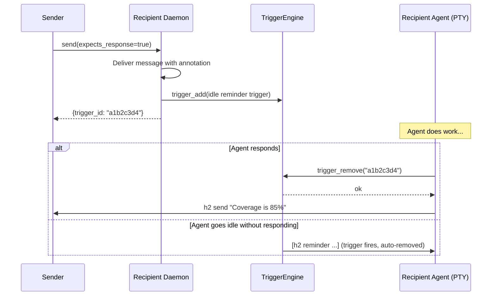

# Design: Expects-Response Message Tracking

## Summary

Add an opt-in protocol for h2 messages that tracks response obligations.
`--expects-response` on `h2 send` creates a trigger on the recipient agent that
fires an idle reminder if the agent hasn't responded. `--responds-to` closes the
obligation by removing the trigger.

This feature is **syntactic sugar over the triggers system** (see
`design-triggers-schedules.md`). No new engines or delivery machinery are
needed — it registers and removes triggers via the existing TriggerEngine.

## User-Facing Interface

### Sending a message that expects a response

```
h2 send --expects-response scheduler "Can you check test coverage?"
```

Prints the trigger ID (8-char short ID) to stdout.

### Delivered message format (what the recipient sees)

```
[h2 message from: user (response expected, id: a1b2c3d4)] Can you check test coverage?
```

The `(response expected, id: <id>)` annotation is only added when
`--expects-response` is set. Normal messages are unchanged.

### Responding to close the obligation

With a message body (sends the response AND closes the obligation):
```
h2 send --responds-to a1b2c3d4 user "Coverage is 85%"
```

Without a message body (just closes the obligation, sends nothing):
```
h2 send --responds-to a1b2c3d4 user
```

Body is optional when `--responds-to` is set.

## How It Works

### `--expects-response`

When `h2 send --expects-response <target> "body"` is called:

1. The message is delivered to the target normally.
2. A trigger is registered on the **recipient's** daemon via the socket:

```go
Trigger{
    ID:    shortID,          // 8-char hex, same as message filename prefix
    Name:  "expects-response-" + shortID,
    Event: "state_change",
    State: "idle",
    Action: Action{
        Message:  fmt.Sprintf(
            "[h2 reminder about message from %s (id: %s)] Respond with: h2 send --responds-to %s %s \"your response\"",
            sender, shortID, shortID, sender,
        ),
        From:     "h2-reminder",
        Priority: "idle",
    },
}
```

The trigger fires once when the agent goes idle, delivering the reminder via the
normal message queue. Since triggers are one-shot, the reminder fires at most
once.

The sender's process has no tracking responsibility — the obligation lives
entirely as a trigger on the recipient's daemon.

### `--responds-to`

When `h2 send --responds-to <id> [target] ["body"]` is called:

1. Resolve self via `resolveActor()`.
2. Find own daemon socket.
3. Send `trigger_remove` request for the given ID to own daemon. This removes
   the reminder trigger.
4. If body is non-empty, send the message to the target as a normal `h2 send`.
5. If body is empty, done — obligation closed, nothing sent.

### Sequence Diagram



## Implementation Details

### `internal/cmd/send.go`

- Add `--expects-response` bool flag.
- Add `--responds-to` string flag (8-char trigger ID).
- When `--expects-response` is set:
  1. Send the message normally to the target daemon.
  2. Construct the reminder trigger (see above).
  3. Send `trigger_add` request to the **target** daemon.
  4. Print the trigger ID to stdout.
- When `--responds-to` is set:
  1. Send `trigger_remove` to own daemon (best-effort — warn if socket not found).
  2. If body is non-empty, send message to target as normal.
  3. If body is empty, exit successfully.
- Body becomes optional when `--responds-to` is set.

### `internal/session/message/delivery.go`

In `deliver()`, when `msg.ExpectsResponse` is true, include the annotation in
the delivery format:

```go
annotation := ""
if msg.ExpectsResponse {
    annotation = fmt.Sprintf(" (response expected, id: %s)", msg.TriggerID)
}
line = fmt.Sprintf("[%s from: %s%s] %s", prefix, msg.From, annotation, body)
```

### `internal/session/message/message.go`

Add two fields to `Message`:

```go
type Message struct {
    // ... existing fields ...
    ExpectsResponse bool   // sender requested a response
    TriggerID       string // 8-char trigger ID for the reminder
}
```

### Wire protocol additions (`internal/session/message/protocol.go`)

Add to `Request`:

```go
type Request struct {
    // ... existing fields ...
    ExpectsResponse bool   `json:"expects_response,omitempty"`
}
```

The `trigger_add` and `trigger_remove` request types already exist from the
triggers design — no new request types needed.

## Edge Cases

**Sender has no daemon socket** (e.g., user terminal): `--responds-to` will fail
to find its own socket. Warn and skip the trigger removal. The reminder trigger
on the recipient still exists and will fire once at idle — acceptable.

**Agent exits without responding**: The trigger is in-memory and lost on exit.
If the agent went idle before exiting, the trigger already fired. If it crashed
without going idle, the reminder never fires — acceptable for a crashed agent.

**Responds-to with unknown ID**: `trigger_remove` returns false. Print a warning
but still send the message body (if any) — the obligation may have already been
fulfilled by the trigger firing at idle.

**Multiple expects-response messages pending**: Each creates its own independent
trigger. All fire at idle, delivered sequentially.

## Testing

### Unit Tests

**`cmd/send_test.go`**:
- `TestSend_ExpectsResponse_CreatesTrigger` — verify trigger_add sent to target daemon
- `TestSend_ExpectsResponse_MessageAnnotation` — verify delivery format includes ID
- `TestSend_RespondsTo_RemovesTrigger` — verify trigger_remove sent to own daemon
- `TestSend_RespondsTo_NoBody` — verify body optional, no message sent
- `TestSend_RespondsTo_WithBody` — verify trigger removed AND message sent

**`message/delivery_test.go`**:
- `TestDeliver_ExpectsResponse_Format` — verify annotation in delivered message
- `TestDeliver_NormalMessage_NoAnnotation` — verify normal messages unchanged

### Integration Tests

- Full round-trip: send `--expects-response`, verify delivery format, send
  `--responds-to`, verify trigger removed
- Idle reminder: send `--expects-response`, let agent go idle, verify reminder
  delivered via trigger
- Multiple pending: send two expects-response messages, verify both create
  independent triggers
