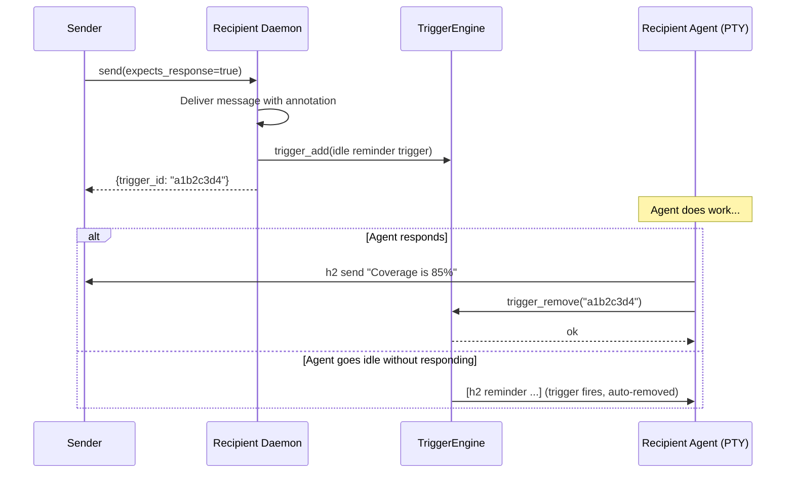

# Design: Expects-Response Message Tracking

## Summary

Add an opt-in protocol for h2 messages that tracks response obligations.
`--expects-response` on `h2 send` creates a trigger on the recipient agent that
fires an idle reminder if the agent hasn't responded. `--responds-to` closes the
obligation by removing the trigger.

This feature is **syntactic sugar over the triggers system** (see
`design-triggers-schedules.md`). No new engines or delivery machinery are
needed — it registers and removes triggers via the existing TriggerEngine.

## User-Facing Interface

### Sending a message that expects a response

```
h2 send --expects-response scheduler "Can you check test coverage?"
```

Prints the trigger ID (8-char short ID) to stdout.

### Delivered message format (what the recipient sees)

```
[h2 message from: user (response expected, id: a1b2c3d4)] Can you check test coverage?
```

The `(response expected, id: <id>)` annotation is only added when
`--expects-response` is set. Normal messages are unchanged.

### Responding to close the obligation

With a message body (target required — sends the response AND closes the obligation):
```
h2 send --responds-to a1b2c3d4 user "Coverage is 85%"
```

Without a message body (target optional — just closes the obligation, sends nothing):
```
h2 send --responds-to a1b2c3d4
```

Body and target are both optional when `--responds-to` is set. Target is required
when body is present (so the CLI knows where to send the response).

## How It Works

### `--expects-response`

When `h2 send --expects-response <target> "body"` is called:

1. The message is delivered to the target normally.
2. A trigger is registered on the **recipient's** daemon via the socket:

```go
Trigger{
    ID:    shortID,          // 8-char hex, same as message filename prefix
    Name:  "expects-response-" + shortID,
    Event: "state_change",
    State: "idle",
    Action: Action{
        Message:  fmt.Sprintf(
            "[h2 reminder about message from %s (id: %s)] Respond with: h2 send --responds-to %s %s \"your response\"",
            sender, shortID, shortID, sender,
        ),
        From:     "h2-reminder",
        Priority: "idle",
    },
}
```

The trigger fires once when the agent goes idle, delivering the reminder via the
normal message queue. Since triggers are one-shot, the reminder fires at most
once.

The sender's process has no tracking responsibility — the obligation lives
entirely as a trigger on the recipient's daemon.

### `--responds-to`

When `h2 send --responds-to <id> [target] ["body"]` is called:

1. Validate arguments: if body is present, target must also be present.
2. Resolve self via `resolveActor()`.
3. Find own daemon socket.
4. If body is non-empty, send the message to the target first. If send fails,
   exit non-zero — the trigger is **not** removed, so the reminder stays active.
5. Send `trigger_remove` request for the given ID to own daemon. If socket not
   found, warn and continue (best-effort).
6. If body was empty (close-only), done — obligation closed, nothing sent.

### Sequence Diagram



## Implementation Details

### `internal/cmd/send.go`

- Add `--expects-response` bool flag.
- Add `--responds-to` string flag (8-char trigger ID).
- When `--expects-response` is set:
  1. Send the message normally to the target daemon.
  2. Generate an 8-char hex trigger ID (same scheme as message filename prefixes).
  3. Construct the reminder trigger (see above).
  4. Send `trigger_add` request to the **target** daemon.
     - If `trigger_add` succeeds: print the trigger ID to stdout, exit 0.
     - If `trigger_add` fails due to ID collision: regenerate ID once and retry.
       If second attempt also collides, print error and exit non-zero.
     - If `trigger_add` fails for any other reason (socket error, daemon down):
       print warning to stderr: `"warning: message delivered but response tracking
       not created: <error>"`. Exit with code **2** (distinct from exit 1 for
       total failure). This lets callers distinguish "delivered without tracking"
       from "nothing happened" and avoid naive retries that would duplicate the
       message. The message was already delivered and is still useful — no
       rollback needed.
- When `--responds-to` is set:
  1. If body is non-empty, target argument is **required**. Send message to target
     first. If send fails, exit non-zero — trigger is NOT removed (reminder stays).
  2. Send `trigger_remove` to own daemon (best-effort — warn if socket not found).
  3. If body is empty, target argument is **optional** (ignored if provided). The
     trigger_remove goes to own daemon only. Exit successfully.
- Body is optional when `--responds-to` is set.
- Validation: `--responds-to` with body but no target is an error (exit non-zero
  with usage message).

### `internal/session/message/delivery.go`

In `deliver()`, when `msg.ExpectsResponse` is true, include the annotation in
the delivery format:

```go
annotation := ""
if msg.ExpectsResponse {
    annotation = fmt.Sprintf(" (response expected, id: %s)", msg.TriggerID)
}
line = fmt.Sprintf("[%s from: %s%s] %s", prefix, msg.From, annotation, body)
```

### `internal/session/message/message.go`

Add two fields to `Message`:

```go
type Message struct {
    // ... existing fields ...
    ExpectsResponse bool   // sender requested a response
    TriggerID       string // 8-char trigger ID for the reminder
}
```

### Wire protocol additions (`internal/session/message/protocol.go`)

Add to `Request`:

```go
type Request struct {
    // ... existing fields ...
    ExpectsResponse bool   `json:"expects_response,omitempty"`
}
```

The `trigger_add` and `trigger_remove` request types already exist from the
triggers design — no new request types needed.

## Edge Cases

**Sender has no daemon socket** (e.g., user terminal): `--responds-to` will fail
to find its own socket. Warn and skip the trigger removal. The reminder trigger
on the recipient still exists and will fire once at idle — acceptable.

**Agent exits without responding**: The trigger is in-memory and lost on exit.
If the agent went idle before exiting, the trigger already fired. If it crashed
without going idle, the reminder never fires — acceptable for a crashed agent.

**Responds-to with unknown ID**: `trigger_remove` returns false. Print a warning
but still send the message body (if any) — the obligation may have already been
fulfilled by the trigger firing at idle.

**Trigger ID collision**: `trigger_add` rejects if the ID already exists in the
TriggerEngine. The CLI regenerates the ID once and retries. A second collision
is a fatal error (exit non-zero). At ~4 billion possible values and typically
single-digit active triggers per agent, collisions are extremely unlikely.

**No sender-context binding on closure**: Obligation closure is keyed only by
trigger ID — there is no validation that the closer is the original sender or
that the target matches. This is intentional: the ID space is large enough that
accidental wrong-ID closure is a user error, not a design gap. The trigger name
(`expects-response-<id>`) provides human-readable context for debugging.

**Multiple expects-response messages pending**: Each creates its own independent
trigger. All fire at idle, delivered sequentially.

## Testing

### Unit Tests

**`cmd/send_test.go`**:
- `TestSend_ExpectsResponse_CreatesTrigger` — verify trigger_add sent to target daemon
- `TestSend_ExpectsResponse_MessageAnnotation` — verify delivery format includes ID
- `TestSend_ExpectsResponse_TriggerAddFails` — verify warning printed, non-zero exit, message still delivered
- `TestSend_ExpectsResponse_IDCollisionRetry` — verify regenerate+retry on first collision, success on second
- `TestSend_ExpectsResponse_IDCollisionFatal` — verify non-zero exit on double collision
- `TestSend_RespondsTo_RemovesTrigger` — verify trigger_remove sent to own daemon
- `TestSend_RespondsTo_NoBody` — verify body and target both optional, no message sent
- `TestSend_RespondsTo_NoBodyWithTarget` — verify target ignored when no body
- `TestSend_RespondsTo_WithBody` — verify trigger removed AND message sent
- `TestSend_RespondsTo_BodyNoTarget` — verify error when body present without target
- `TestSend_RespondsTo_MissingSocket` — verify warning printed, message still sent if body present

**`message/delivery_test.go`**:
- `TestDeliver_ExpectsResponse_Format` — verify annotation in delivered message
- `TestDeliver_NormalMessage_NoAnnotation` — verify normal messages unchanged

### Integration Tests

- Full round-trip: send `--expects-response`, verify delivery format, send
  `--responds-to`, verify trigger removed
- Idle reminder: send `--expects-response`, let agent go idle, verify reminder
  delivered via trigger
- Multiple pending: send two expects-response messages, verify both create
  independent triggers

## Round 1 Review Disposition

| # | Reviewer | Severity | Summary | Disposition | Notes |
|---|----------|----------|---------|-------------|-------|
| 1 | h2-reviewer | P1 | Non-atomic send+trigger creation | Incorporated | Added error semantics: CLI exits non-zero on trigger_add failure, prints warning that message was delivered but tracking not created |
| 2 | h2-reviewer | P1 | 8-char ID collision handling | Incorporated | Kept 8-char IDs, added collision behavior: trigger_add rejects on conflict, CLI regenerates once and retries |
| 3 | h2-reviewer | P2 | responds-to target semantics | Incorporated | Target required when body present, optional for close-only mode; added validation rules |
| 4 | h2-reviewer | P2 | Test plan missing failure paths | Incorporated | Added 6 failure-path tests: trigger_add failure, ID collision, missing socket, body-without-target |

## Round 2 Review Disposition

| # | Reviewer | Severity | Summary | Disposition | Notes |
|---|----------|----------|---------|-------------|-------|
| 1 | h2-reviewer | P1 | responds-to clears trigger before confirming delivery | Incorporated | Reordered: send response first, then trigger_remove on success; send failure preserves trigger |
| 2 | h2-reviewer | P2 | Obligation closure not bound to sender metadata | Not Incorporated | Intentional: closure by trigger ID only, wrong-ID is user error; added explicit edge case note |
| 3 | h2-reviewer | P2 | Non-zero exit after delivery causes duplicate retries | Incorporated | Added distinct exit code 2 for "delivered without tracking" vs exit 1 for total failure |
