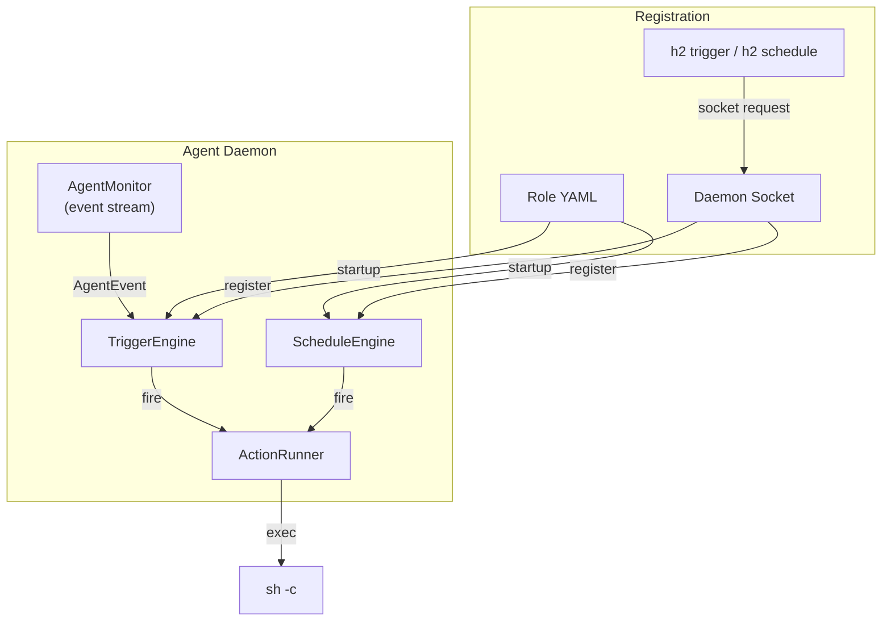
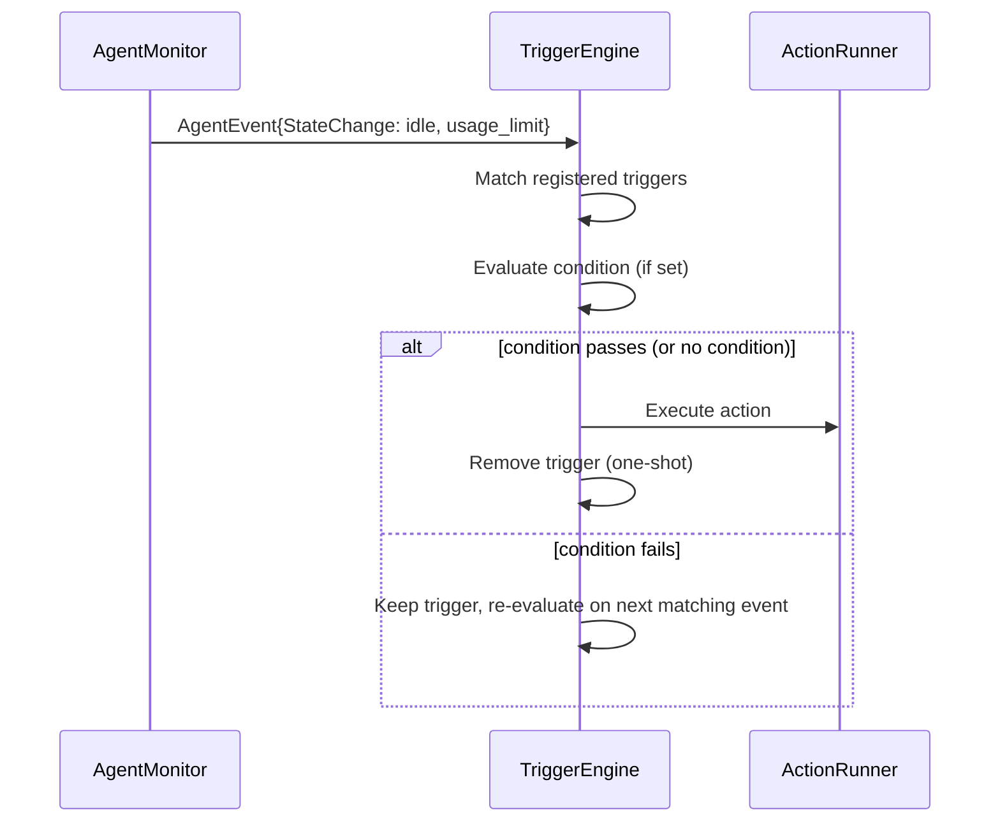
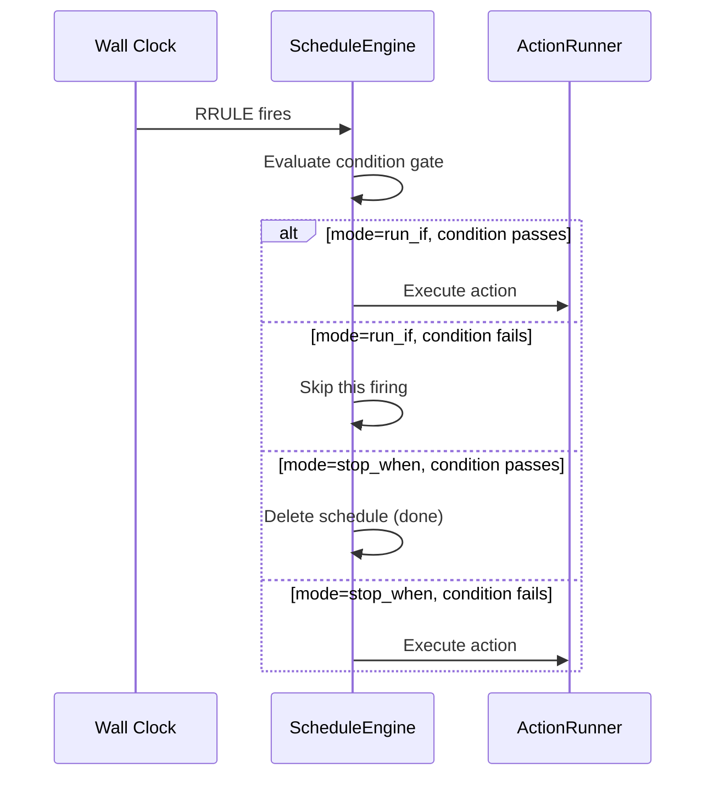

# Design: Triggers and Schedules

## Summary

Add a general-purpose event-driven automation system to h2 agents. Two
primitives — **triggers** and **schedules** — let agents react to state changes
and run actions at specified times without polling.

A **trigger** fires once, immediately, when a condition becomes true. Once it
fires (or is deleted before firing), it is gone.

A **schedule** fires at one or more times defined by an RRULE. Each firing can
optionally be gated by a condition. Schedules support three condition modes that
control how the gate interacts with firings.

Both primitives execute an **action**. An action is either a shell command
(`exec`) or a message sent to the agent (`message`). The message action injects
text directly into the agent's PTY via the message queue — no shelling out
needed. Both can be defined statically in a role file or registered dynamically
on a running agent via the CLI.

This system supersedes the existing heartbeat nudge mechanism. Heartbeats become
a schedule with an idle-timeout interval and an optional condition gate.

## Motivating Use Cases

1. **Expects-response reminders** — trigger: agent goes idle, condition: pending
   responses exist, action: message "You have unresponded messages" (priority:
   idle).

2. **Credential rotation on rate limit** — trigger: agent enters `usage_limit`
   substate, action: exec `h2 rotate <agent> <next-profile>`.

3. **Permission request escalation** — trigger: agent enters
   `waiting_for_permission` substate, action: exec `h2 send --bridge user
   "Agent needs permission approval"`.

4. **Heartbeat nudge (replaces current system)** — schedule: every 30s,
   condition: optional bash check, action: message "Are you still working?"
   (priority: idle).

5. **Periodic status report** — schedule: every 10 minutes, action: exec
   `h2 send scheduler "Still working on task X"`.

## Architecture

### Event Sources

Triggers subscribe to the agent's existing event stream
(`monitor.AgentEvent`). The relevant event types for triggers:

| Event | Available Data |
|-------|---------------|
| `EventStateChange` | `State` (initialized/active/idle/exited), `SubState` (thinking/tool_use/waiting_for_permission/compacting/usage_limit) |
| `EventApprovalRequested` | Permission request details |
| `EventTurnCompleted` | Turn completion data |
| `EventSessionStarted` | Session start |
| `EventSessionEnded` | Exit reason |

Schedules use wall-clock time via RRULE evaluation, independent of the event
stream.

### Component Diagram



### Data Flow: Trigger



### Data Flow: Schedule



## Data Model

### Trigger

```go
// Trigger fires once when an event matches and the condition (if any) passes.
type Trigger struct {
    ID        string   // unique identifier (auto-generated or user-provided)
    Name      string   // human-readable label (optional)

    // Event matching
    Event     string   // event type to match: "state_change", "approval_requested", etc.
    State     string   // for state_change: match this state ("idle", "active", "exited")
    SubState  string   // for state_change: match this substate ("usage_limit", "waiting_for_permission", etc.)

    // Condition gate (optional)
    Condition string   // shell command; trigger fires only if exit code 0

    // Action (exactly one of these is set)
    Action Action
}
```

### Schedule

```go
// Schedule fires at times defined by a start time + RRULE, optionally gated
// by a condition.
type Schedule struct {
    ID        string   // unique identifier
    Name      string   // human-readable label (optional)

    // Timing
    Start     string   // start time (RFC 3339); defaults to now if empty
    RRule     string   // RRULE string (RFC 5545), e.g. "FREQ=SECONDLY;INTERVAL=30"

    // Condition gate (optional)
    Condition     string        // shell command
    ConditionMode ConditionMode // how the condition interacts with firings

    // Action (exactly one of these is set)
    Action Action
}

// Action defines what happens when a trigger fires or a schedule ticks.
// Exactly one of Exec or Message must be set.
type Action struct {
    // Exec runs a shell command via sh -c in the agent's environment.
    Exec string

    // Message injects a message into the agent's PTY via the message queue.
    // The message is delivered as if sent by the given From identity
    // (defaults to "h2-trigger" or "h2-schedule" depending on source) at the given Priority (defaults to "normal").
    Message  string
    From     string   // sender identity for the message (default: "h2-automation")
    Priority string   // message priority: "interrupt", "normal", "idle-first", "idle"
}

type ConditionMode int

const (
    // RunIf: execute the action only when the condition passes (exit 0).
    // If condition fails, skip this firing but keep the schedule alive.
    RunIf ConditionMode = iota

    // StopWhen: execute the action on each firing UNTIL the condition passes.
    // Once condition passes (exit 0), delete the schedule.
    StopWhen

    // RunOnceWhen: skip firings until the condition passes, execute the action
    // once, then delete the schedule. Like a trigger but on a polling schedule.
    RunOnceWhen
)
```

### Role YAML

```yaml
triggers:
  - name: rotate-on-rate-limit
    event: state_change
    sub_state: usage_limit
    exec: h2 rotate {{ .AgentName }} next-profile

  - name: bridge-permission-request
    event: approval_requested
    exec: h2 send --bridge user "{{ .AgentName }} needs permission approval"

schedules:
  - name: heartbeat
    rrule: "FREQ=SECONDLY;INTERVAL=30"
    # start omitted — defaults to agent start time
    condition: "test -f /tmp/heartbeat-enabled"
    condition_mode: run_if
    message: "Are you still working?"
    priority: idle

  - name: status-report
    rrule: "FREQ=MINUTELY;INTERVAL=10"
    # start omitted — defaults to agent start time
    exec: h2 send scheduler "{{ .AgentName }} still active"
```

In YAML, `exec` and `message` are the two action types. Set exactly one per
trigger or schedule. For `message`, optional `from` (default: `h2-trigger` or `h2-schedule`)
and `priority` (default: `normal`) fields are available.

Trigger and schedule action strings are rendered through the existing role
template engine, giving access to `{{ .AgentName }}`, `{{ .Var.x }}`, etc.

## CLI Interface

### Triggers

```
# Register a trigger with a shell action
h2 trigger add <agent-name> \
    --event state_change \
    --sub-state usage_limit \
    --exec 'h2 rotate <agent-name> next-profile'

# Register a trigger with a message action
h2 trigger add <agent-name> \
    --event approval_requested \
    --message "You have a pending permission request" \
    --priority interrupt

# List triggers
h2 trigger list <agent-name>

# Remove a trigger before it fires
h2 trigger remove <agent-name> <trigger-id>
```

### Schedules

```
# Register a schedule with a shell action (start defaults to now)
h2 schedule add <agent-name> \
    --rrule "FREQ=MINUTELY;INTERVAL=5" \
    --exec 'h2 send scheduler "status update"'

# Register a schedule with a message action and explicit start time
h2 schedule add <agent-name> \
    --start "2026-03-06T14:00:00Z" \
    --rrule "FREQ=SECONDLY;INTERVAL=30" \
    --condition "test -f /tmp/check" \
    --condition-mode run_if \
    --message "Are you still working?" \
    --priority idle

# List schedules
h2 schedule list <agent-name>

# Remove a schedule
h2 schedule remove <agent-name> <schedule-id>
```

The `--exec` and `--message` flags are mutually exclusive. For `--message`,
optional `--from` (default: `h2-trigger` or `h2-schedule`) and `--priority` (default:
`normal`) flags are available.

### Dynamic registration via socket

The CLI commands send requests to the agent's daemon socket:

```go
// New request types for listener.go
Request{Type: "trigger_add", Trigger: &Trigger{...}}
Request{Type: "trigger_list"}
Request{Type: "trigger_remove", TriggerID: "..."}
Request{Type: "schedule_add", Schedule: &Schedule{...}}
Request{Type: "schedule_list"}
Request{Type: "schedule_remove", ScheduleID: "..."}
```

## Implementation Details

### TriggerEngine

The TriggerEngine subscribes to the session's event stream (the same
`chan monitor.AgentEvent` that the harness writes to). It runs as a goroutine
started by the daemon alongside the monitor.

```go
type TriggerEngine struct {
    mu       sync.Mutex
    triggers map[string]*Trigger  // keyed by ID
    runner   *ActionRunner
}

func (te *TriggerEngine) Run(ctx context.Context, events <-chan monitor.AgentEvent)
func (te *TriggerEngine) Add(t *Trigger)
func (te *TriggerEngine) Remove(id string) bool
func (te *TriggerEngine) List() []*Trigger
```

On each event, the engine iterates registered triggers and checks:
1. Does the event type match `t.Event`?
2. For state changes: do State/SubState match (empty means "any")?
3. If a condition is set, does `sh -c <condition>` exit 0?
4. If all pass: run the action, remove the trigger.

The event channel is a fan-out from the monitor — the trigger engine gets its
own copy so it doesn't block the harness or message delivery pipeline.

### ScheduleEngine

The ScheduleEngine evaluates RRULEs and manages timers. It runs as a goroutine.

```go
type ScheduleEngine struct {
    mu        sync.Mutex
    schedules map[string]*activeSchedule
    runner    *ActionRunner
}

type activeSchedule struct {
    spec  *Schedule
    timer *time.Timer  // next firing
}

func (se *ScheduleEngine) Run(ctx context.Context)
func (se *ScheduleEngine) Add(s *Schedule)
func (se *ScheduleEngine) Remove(id string) bool
func (se *ScheduleEngine) List() []*Schedule
```

For each schedule, the engine computes the next occurrence from the start time +
RRULE, sets a timer, and when it fires:
1. Evaluate condition + mode.
2. If action should run, run it.
3. If schedule should continue, compute next occurrence and reset timer.
4. If schedule should stop (StopWhen condition met, or RunOnceWhen fired, or
   RRULE exhausted), remove it.

### ActionRunner

Shared by both engines. Dispatches actions by type.

```go
type ActionRunner struct {
    agentName string
    cwd       string
    env       []string              // inherited env + H2_AGENT_NAME, etc.
    queue     *message.MessageQueue // for message actions
}

func (ar *ActionRunner) Run(action Action) error
```

For `Exec` actions: run via `sh -c <action>` with the agent's working directory
and environment. Runs asynchronously — the engine does not block waiting for
completion. Stdout/stderr are logged to the session activity log.

For `Message` actions: call `message.PrepareMessage()` to enqueue the message
directly into the agent's message queue. This is synchronous and fast — no
subprocess, no socket round-trip. The message is delivered to the agent's PTY
through the normal delivery pipeline with the specified priority.

### Daemon Integration

In `daemon.go`, after creating the session and starting the monitor:

```go
// Create engines
actionRunner := &automation.ActionRunner{...}
triggerEngine := automation.NewTriggerEngine(actionRunner)
scheduleEngine := automation.NewScheduleEngine(actionRunner)

// Load from role config
for _, t := range rc.Triggers {
    triggerEngine.Add(t)
}
for _, s := range rc.Schedules {
    scheduleEngine.Add(s)
}

// Start engines
go triggerEngine.Run(ctx, eventFanOut)
go scheduleEngine.Run(ctx)
```

The listener handles the new request types by calling Add/Remove/List on the
engines.

### Heartbeat Migration

The existing `HeartbeatConfig` in roles and `RunHeartbeat` goroutine are
removed. Heartbeats are expressed as schedules:

**Before (role YAML):**
```yaml
heartbeat:
  idle_timeout: 30s
  message: "Are you still working?"
  condition: "test -f /tmp/check"
```

**After (role YAML):**
```yaml
schedules:
  - name: heartbeat
    rrule: "FREQ=SECONDLY;INTERVAL=30"
    # start omitted — defaults to agent start time
    condition: "test -f /tmp/check"
    condition_mode: run_if
    message: "Are you still working?"
    priority: idle
```

The old heartbeat had an implicit "only when idle" gate. In the new system this
is expressed by having the action use `--priority idle` (delivered only when
idle) or by adding a condition that checks agent state.

One behavioral difference: the old heartbeat waited for the agent to be idle for
the full timeout duration before firing. A schedule fires on the RRULE interval
regardless of state — the idle gating is done via the message priority or a
condition. This is simpler and more predictable.

## Package Structure

```
internal/automation/
    trigger.go       // Trigger struct, TriggerEngine
    schedule.go      // Schedule struct, ScheduleEngine, ConditionMode
    runner.go        // ActionRunner
    automation.go    // Shared types, condition evaluation
    trigger_test.go
    schedule_test.go
    runner_test.go
```

## Testing

### Unit Tests

**`automation/trigger_test.go`**:
- `TestTriggerEngine_FiresOnMatch` — register trigger, send matching event, verify action runs
- `TestTriggerEngine_NoMatchWrongEvent` — send non-matching event, verify no action
- `TestTriggerEngine_NoMatchWrongState` — state_change with wrong state, no action
- `TestTriggerEngine_SubStateMatch` — match on substate (e.g. usage_limit)
- `TestTriggerEngine_WildcardState` — empty state matches any state_change
- `TestTriggerEngine_ConditionPass` — condition exits 0, trigger fires
- `TestTriggerEngine_ConditionFail` — condition exits non-0, trigger stays registered
- `TestTriggerEngine_ConditionFailThenPass` — condition fails on first event, passes on second
- `TestTriggerEngine_OneShot` — trigger removed after firing, second event does nothing
- `TestTriggerEngine_Remove` — remove trigger before it fires
- `TestTriggerEngine_AddViaSocket` — register trigger via socket request

**`automation/schedule_test.go`**:
- `TestScheduleEngine_FiresOnTime` — RRULE fires, action runs
- `TestScheduleEngine_RunIf_ConditionPass` — run_if mode, condition passes, action runs
- `TestScheduleEngine_RunIf_ConditionFail` — run_if mode, condition fails, action skipped, schedule continues
- `TestScheduleEngine_StopWhen_ConditionFail` — stop_when mode, condition fails, action runs
- `TestScheduleEngine_StopWhen_ConditionPass` — stop_when mode, condition passes, schedule removed
- `TestScheduleEngine_RunOnceWhen_EventuallyFires` — run_once_when skips until condition passes, fires once, removed
- `TestScheduleEngine_RecurringRRule` — multiple firings at correct intervals
- `TestScheduleEngine_FiniteRRule` — RRULE with COUNT, schedule removed after last firing
- `TestScheduleEngine_Remove` — remove schedule before it fires

**`automation/runner_test.go`**:
- `TestActionRunner_Success` — action exits 0
- `TestActionRunner_Failure` — action exits non-0, error logged
- `TestActionRunner_Async` — action runs without blocking caller
- `TestActionRunner_Environment` — verify env vars available to action

### Integration Tests

- Register trigger via role YAML, start agent, simulate state change, verify action ran
- Register schedule via CLI on running agent, verify it fires at the expected time
- Heartbeat migration: define schedule-based heartbeat in role, verify nudge delivered at idle
- Multiple triggers on same event: verify all fire
- Remove trigger via CLI, verify it doesn't fire on subsequent events
