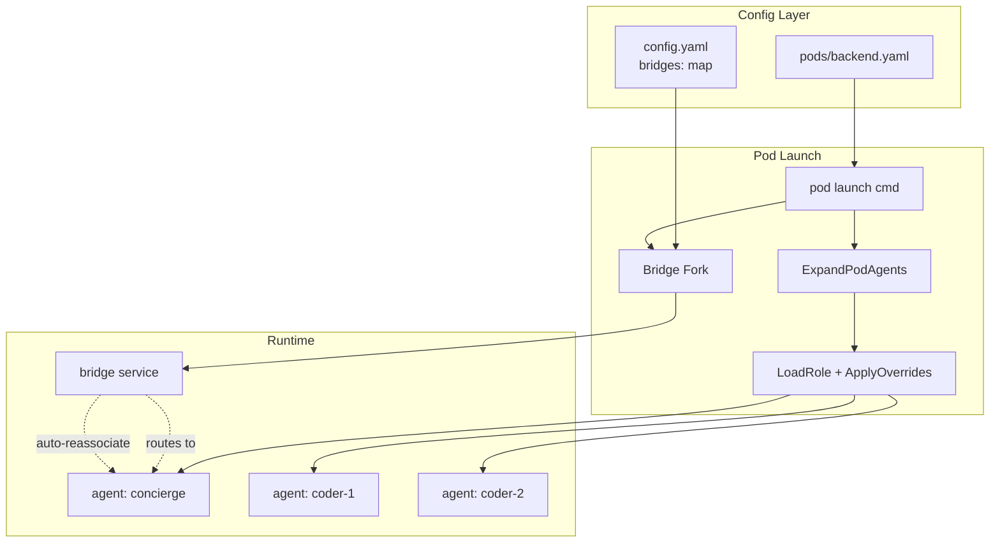
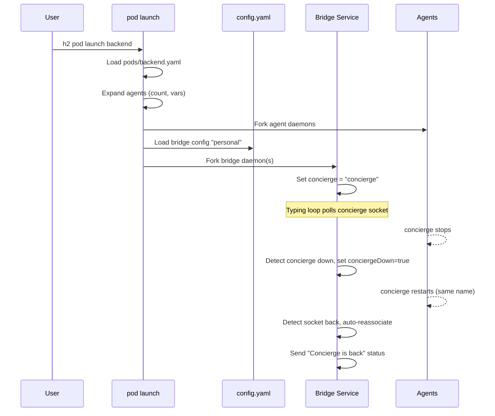
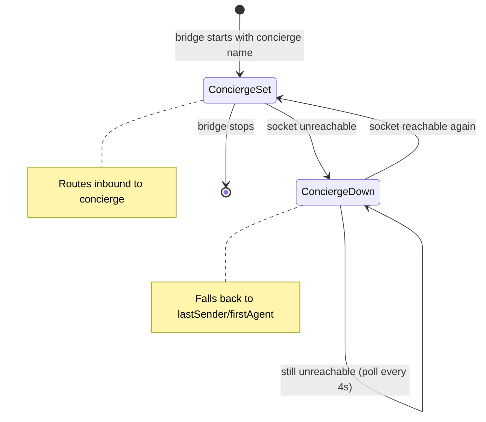

# Pod Simplification & Bridge Integration

## Summary

Simplify the pod system by:
1. Flattening pod YAML from `pods/templates/<name>.yaml` to `pods/<name>.yaml`, eliminating the separate `pods/roles/` directory
2. Adding inline role field overrides directly in pod agent entries
3. Moving bridge configuration into the pod YAML (while also supporting standalone bridges)
4. Extracting bridge credentials from user-scoped config into a top-level named `bridges:` map in `config.yaml`
5. Fixing bridge-concierge auto-reassociation when a concierge agent restarts

## Architecture

### Pod YAML Format (New)

```yaml
pod_name: backend

bridges:
  - bridge: personal          # references top-level bridges.<name> in config.yaml
    concierge: concierge      # optional; points to an agent defined below
  - bridge: work
    concierge: ops-concierge

agents:
  - name: concierge
    role: concierge
    overrides:
      agent_model: opus

  - name: coder
    role: coding
    count: 3
    vars:
      focus_area: backend
    overrides:
      worktree_enabled: true
      worktree_branch_from: main

  - name: reviewer
    role: reviewer
```

### Global Config (New)

```yaml
# config.yaml
bridges:
  personal:
    telegram:
      bot_token: "..."
      chat_id: 12345
    macos_notify:
      enabled: true
  work:
    telegram:
      bot_token: "..."
      chat_id: 67890

users:
  dcosson:
    # bridges: removed from here (see migration)
```

### Component Diagram



### Sequence: Pod Launch with Bridge



### State: Bridge Concierge Tracking



## Detailed Design

### 1. Directory Structure Change

**Before:**
```
<h2-dir>/
  pods/
    roles/        # pod-scoped role overrides
    templates/    # pod template YAML files
```

**After:**
```
<h2-dir>/
  pods/           # pod YAML files directly here
    backend.yaml
    frontend.yaml
```

`pods/roles/` is eliminated entirely. The role override use case is replaced by inline `overrides:` on each agent entry.

#### Functions to change

| Function | File | Change |
|----------|------|--------|
| `PodTemplatesDir()` | `internal/config/pods.go` | Remove; replace with `PodDir()` returning `<h2-dir>/pods/` |
| `PodRolesDir()` | `internal/config/pods.go` | Remove entirely |
| `LoadPodRole()` | `internal/config/pods.go` | Remove; callers use `LoadRole()` + `ApplyOverrides()` |
| `LoadPodRoleRendered()` | `internal/config/pods.go` | Remove; same approach |
| `IsPodScopedRole()` | `internal/config/pods.go` | Remove entirely |
| `ListPodRoles()` | `internal/config/pods.go` | Remove entirely |
| `LoadPodTemplate()` | `internal/config/pods.go` | Update path to `PodDir()` |
| `LoadPodTemplateRendered()` | `internal/config/pods.go` | Update path to `PodDir()` |
| `ListPodTemplates()` | `internal/config/pods.go` | Update path to `PodDir()` |

### 2. Pod YAML Schema

```go
// PodTemplate defines a set of agents and bridges to launch together.
type PodTemplate struct {
    PodName   string                 `yaml:"pod_name"`
    Variables map[string]tmpl.VarDef `yaml:"variables"`
    Bridges   []PodBridge            `yaml:"bridges"`
    Agents    []PodTemplateAgent     `yaml:"agents"`
}

// PodBridge links a named bridge config to a concierge agent in the pod.
type PodBridge struct {
    Bridge    string `yaml:"bridge"`    // key into config.yaml bridges map
    Concierge string `yaml:"concierge"` // agent name in this pod; empty = no concierge
}

// PodTemplateAgent defines a single agent within a pod.
type PodTemplateAgent struct {
    Name      string            `yaml:"name"`
    Role      string            `yaml:"role"`
    Count     *int              `yaml:"count,omitempty"`
    Vars      map[string]string `yaml:"vars"`
    Overrides map[string]string `yaml:"overrides"` // role field overrides (yaml tag = value)
}
```

#### Overrides mechanism

`overrides:` is a `map[string]string` using the same key format as `--override` on `h2 run`. This reuses the existing `ApplyOverrides()` function in `internal/config/override.go`, which already supports:
- Flat fields: `agent_model`, `working_dir`, `worktree_enabled`, etc.
- Dot-notation nested fields: `heartbeat.idle_timeout`, `heartbeat.message`
- Type coercion: strings, bools, ints, `*bool`
- Blocked fields: `role_name`, `instructions`, `hooks`, `settings`

The pod launch flow becomes:
1. Load and render the base role via `LoadRoleRendered(roleName, ctx)`
2. Convert `overrides` map to `[]string` (`key=value` pairs)
3. Call `ApplyOverrides(role, overrideSlice)`
4. Pass the overridden role to `setupAndForkAgentQuiet()`

This means pod-level overrides use the exact same code path as `h2 run --override`, with the same validation and error messages.

#### Validation

On pod load, validate:
- Each `PodBridge.Bridge` references a key that exists in the global `bridges:` config
- Each `PodBridge.Concierge` (if non-empty) matches an agent name defined in the pod's `agents:` list (after count expansion)
- Override keys are valid (delegated to `ApplyOverrides` at launch time)

### 3. Global Bridge Config Extraction

Move bridge credentials from per-user config to a top-level named map.

**Before:**
```go
type Config struct {
    Users map[string]*UserConfig `yaml:"users"`
}
type UserConfig struct {
    Bridges BridgesConfig `yaml:"bridges"`
}
```

**After:**
```go
type Config struct {
    Bridges map[string]*BridgesConfig `yaml:"bridges"` // named bridge configs
    Users   map[string]*UserConfig    `yaml:"users"`
}
type UserConfig struct {
    // bridges field removed
}
```

#### Migration

- `h2 bridge create` currently resolves user → user config → bridges. It will instead accept a `--bridge <name>` flag to select from the top-level map.
- Remove the `Bridges` field from `UserConfig` entirely. Old config files with user-scoped bridges will fail to parse — users must update their `config.yaml`.
- Remove the `resolveUser()` helper in `bridge.go`; replace with `resolveBridgeConfig(cfg, name)` that looks up from the top-level map directly.

#### Standalone bridge create (outside pods)

```bash
# New: reference a named bridge config
h2 bridge create --bridge personal --concierge-role concierge

# Pod launch handles bridges automatically
h2 pod launch backend
```

### 4. Pod Launch Bridge Integration

When `h2 pod launch` encounters `bridges:` in the pod YAML:

1. Load the global config to resolve each bridge name → `BridgesConfig`
2. For each `PodBridge`:
   a. Stop any existing bridge daemon for the same bridge name (idempotent restart)
   b. Call `bridgeservice.ForkBridge(bridgeName, concierge)` with the resolved config
3. Bridge launch happens **after** all agents are started (so concierge socket exists)

When `h2 pod stop <pod>` is called:
- Stop all agents in the pod (existing behavior)
- Also stop any bridge daemons that were launched with this pod

To track which bridges belong to a pod, the bridge service needs the pod name. Add `Pod string` to the bridge daemon's args and to `BridgeInfo` in the status response. This mirrors how agents report their pod.

### 5. Bridge Concierge Auto-Reassociation

**Current behavior** (`service.go:593`): When the typing loop detects the concierge socket is unreachable, `handleConciergeDown()` clears `s.concierge` to empty string. The concierge name is lost permanently.

**New behavior:** The bridge remembers its configured concierge name and automatically re-associates when the socket comes back.

#### Implementation

Add a field to distinguish the configured concierge from its liveness state:

```go
type Service struct {
    // ...
    concierge      string // configured concierge name; never cleared after initial set
    conciergeAlive bool   // true when socket is reachable
    // ...
}
```

Changes to the typing loop (`runTypingLoop`):

```go
// Current code (lines 455-479):
conciergeWasAlive := false
for {
    // ...
    if concierge != "" {
        _, err := s.queryAgentState(concierge)
        if err != nil {
            if conciergeWasAlive {
                conciergeWasAlive = false
                s.handleConciergeDown(ctx, concierge)
            }
        } else {
            conciergeWasAlive = true
        }
    }
}

// New code:
for {
    // ...
    s.mu.Lock()
    concierge := s.concierge
    wasAlive := s.conciergeAlive
    s.mu.Unlock()

    if concierge != "" {
        _, err := s.queryAgentState(concierge)
        if err != nil {
            if wasAlive {
                s.mu.Lock()
                s.conciergeAlive = false
                s.mu.Unlock()
                s.handleConciergeDown(ctx, concierge)
            }
        } else {
            if !wasAlive {
                s.mu.Lock()
                s.conciergeAlive = true
                s.mu.Unlock()
                s.handleConciergeUp(ctx, concierge)
            }
        }
    }
}
```

Changes to `handleConciergeDown`:
```go
func (s *Service) handleConciergeDown(ctx context.Context, agentName string) {
    // DO NOT clear s.concierge — keep the name for reassociation
    s.mu.Lock()
    s.lastRoutedAgent = ""
    s.mu.Unlock()

    firstAgent := s.firstAvailableAgent()
    msg := fmt.Sprintf("Concierge agent %s stopped. %s Will auto-reconnect when it restarts.",
        agentName, noConciergeRouting(firstAgent))
    s.sendBridgeStatus(ctx, msg)
}
```

New `handleConciergeUp`:
```go
func (s *Service) handleConciergeUp(ctx context.Context, agentName string) {
    msg := fmt.Sprintf("Concierge agent %s is back. %s", agentName, conciergeRouting(agentName))
    s.sendBridgeStatus(ctx, msg)
}
```

Changes to `resolveDefaultTarget`:
```go
func (s *Service) resolveDefaultTarget() string {
    s.mu.Lock()
    concierge := s.concierge
    alive := s.conciergeAlive
    last := s.lastSender
    s.mu.Unlock()

    // Only route to concierge if it's alive
    if concierge != "" && alive {
        return concierge
    }
    if last != "" {
        return last
    }
    // Fall back to first available agent
    // ...
}
```

The `set-concierge` and `remove-concierge` socket commands continue to work as before — they update `s.concierge` directly. `remove-concierge` sets it to empty, which disables auto-reassociation (intentional).

#### Why this works for both pod and standalone bridges

The auto-reassociation is purely bridge-level behavior based on socket discovery. It doesn't matter whether the bridge was launched from a pod or standalone — if it has a concierge name configured and that socket reappears, it reconnects. The 4-second polling interval means reconnection happens within ~4 seconds of the agent restarting.

### 6. Pod Agent Restart Flow

No new commands needed. The existing mechanisms compose naturally:

```bash
# Restart a single agent in a pod:
h2 stop coder-2
h2 pod launch backend    # re-launches only missing agents (existing skip logic)

# Or manually:
h2 stop coder-2
h2 run coder-2 --role coding --pod backend --resume
```

`h2 pod launch` already checks `podRunningAgents()` and skips agents whose sockets are live. A stopped agent's socket is removed, so re-launch picks it up.

The bridge auto-reassociation (section 5) means if the concierge is the agent being restarted, the bridge handles it automatically.

## Package/Module Structure

No new packages. Changes are confined to:

| Package | Files Changed |
|---------|---------------|
| `internal/config` | `pods.go`, `config.go` |
| `internal/cmd` | `pod.go`, `bridge.go`, `bridge_daemon.go` |
| `internal/bridgeservice` | `service.go`, `fork.go` |

## Testing

### Unit Tests

#### `internal/config/pods_test.go`
- **PodDir path**: Verify `PodDir()` returns `<h2-dir>/pods/`
- **Overrides in YAML**: Parse pod YAML with `overrides:` map, verify round-trip
- **PodBridge parsing**: Parse `bridges:` list with bridge/concierge fields
- **Concierge validation**: Verify error when concierge references non-existent agent name
- **Bridge name validation**: Verify error when bridge references non-existent config key
- **Old path gone**: Verify loading from old `pods/templates/` path returns file-not-found error

#### `internal/config/config_test.go`
- **Top-level bridges map**: Parse config with named bridge configs
- **Old user-scoped bridges rejected**: Config with bridges under `users:` instead of top-level `bridges:` fails to load with a clear error

#### `internal/bridgeservice/service_test.go`
- **Concierge down + back up**: Mock agent socket, stop it, verify `conciergeAlive=false` and status message. Restart socket, verify `conciergeAlive=true` and "is back" status message.
- **Routing while concierge down**: Verify `resolveDefaultTarget` falls back to lastSender/firstAgent when `conciergeAlive=false` but `concierge` is still set.
- **remove-concierge clears name**: Verify `remove-concierge` sets `concierge=""` so no auto-reassociation.

#### `internal/cmd/pod_test.go`
- **Launch with overrides**: Pod template with overrides, verify `ApplyOverrides` called and RuntimeConfig reflects overridden values
- **Launch with bridges**: Pod template with bridges, verify bridge fork called with correct config name and concierge
- **Stop with bridges**: Verify `pod stop` also stops pod-associated bridges
- **Dry-run with overrides**: Verify dry-run output shows overrides

### Integration Tests

- **Full pod lifecycle**: Launch pod with bridge + agents, verify bridge status, stop concierge, verify bridge detects down, restart concierge (via pod launch), verify bridge auto-reassociates
- **Override precedence**: Pod YAML overrides vs role defaults, verify overrides win
