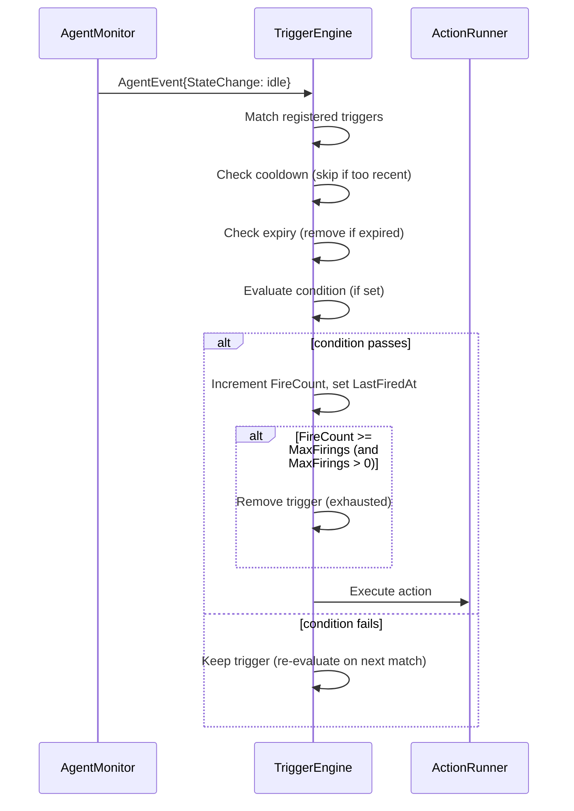
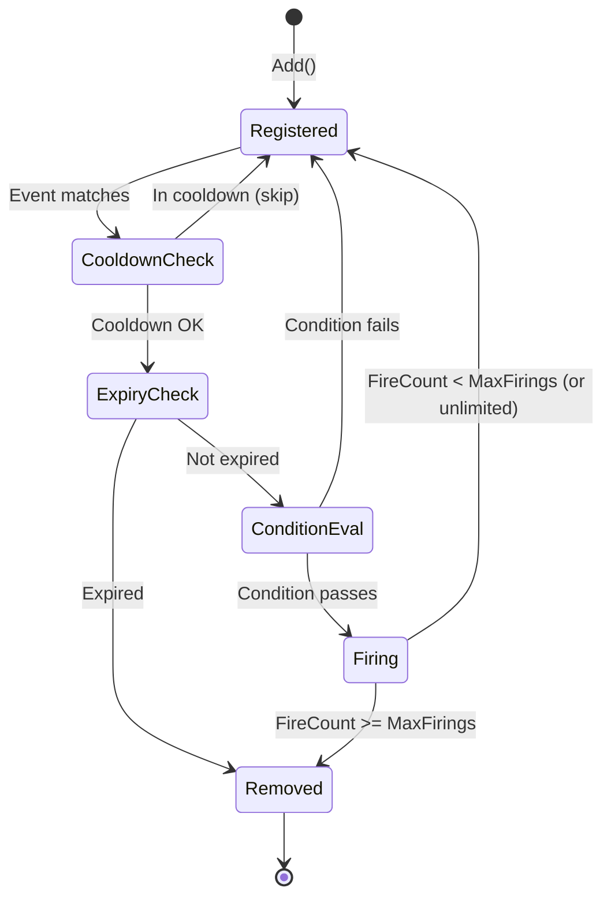

# Plan: Repeating Triggers

**Status**: Draft
**Author**: h2-coder-1
**Date**: 2026-03-09
**Branch**: feature/expects-response-tracking

## Summary

Extend the trigger system to support repeating triggers — triggers that fire more than once. Currently triggers are strictly one-shot: they fire once and are removed. This plan adds three new fields to the Trigger struct that control trigger lifecycle:

1. **MaxFirings** — maximum number of times the trigger can fire (−1 = unlimited, 0/1 = one-shot default)
2. **ExpiresAt** — RFC 3339 timestamp after which the trigger is auto-removed regardless of fire count
3. **Cooldown** — minimum duration between firings to prevent rapid re-fire on repeated state transitions

This is a targeted extension to the existing trigger system. It does not change schedules, the ActionRunner, or the general event-matching logic — only the lifecycle management in `evalAndFire`.

### Key Design Decisions

- **Default is one-shot** (`MaxFirings=1`): existing behavior is preserved; all current callers (role YAML, expects-response, CLI) continue working without changes.
- **Cooldown is critical** for repeating triggers: without it, an idle-matching trigger would fire every time the agent transitions to idle (potentially every few seconds). The cooldown field makes repeating triggers practical.
- **ExpiresAt** provides a time-based lifecycle bound, useful for "monitor this for the next hour" patterns.
- **No persistence changes**: repeating triggers are still ephemeral (in-memory). Role-defined triggers are re-loaded on daemon restart.

## Motivating Use Cases

1. **Ongoing idle nudge** — trigger fires every time the agent goes idle (with 5m cooldown) to remind it to keep working. Unlike a schedule, this is event-driven: it only fires when the agent actually goes idle.
2. **Rate-limit rotation with retry** — trigger on `usage_limit` substate that fires up to 3 times (`MaxFirings=3`) to try different credential profiles.
3. **Time-bounded monitoring** — trigger on `state_change` with `ExpiresAt` 1 hour from now, notifying a bridge when the agent changes state during a critical deployment window.
4. **Permission escalation chain** — trigger on `waiting_for_permission` that fires up to 3 times with increasing cooldown (first immediately, then after 2 min, then 5 min) — though this plan implements fixed cooldown, not progressive.

## Architecture

### Data Flow: Repeating Trigger



### State Diagram: Trigger Lifecycle



## Data Model

### Updated Trigger Struct

```go
// Trigger fires when an event matches and the optional condition passes.
// By default triggers are one-shot (MaxFirings=1). Set MaxFirings=0 for
// unlimited firings, or MaxFirings=N for a fixed count.
type Trigger struct {
    ID   string
    Name string

    // Event matching (unchanged).
    Event    string
    State    string
    SubState string

    // Condition gate (unchanged).
    Condition string

    Action Action

    // Lifecycle control (new fields).
    MaxFirings int           // -1 = unlimited, 0 = default (one-shot), N > 0 = fire N times
    ExpiresAt  time.Time     // zero value = no expiry
    Cooldown   time.Duration // zero value = no cooldown

    // Runtime tracking (internal, not user-configured).
    FireCount   int       // number of times this trigger has fired
    LastFiredAt time.Time // timestamp of last firing (for cooldown enforcement)
}
```

### Wire Format Changes

**TriggerSpec** (message/protocol.go) — add three fields:

```go
type TriggerSpec struct {
    // ... existing fields ...
    MaxFirings int    `json:"max_firings,omitempty"` // -1=unlimited, 0=default (one-shot)
    ExpiresAt  string `json:"expires_at,omitempty"`  // RFC 3339 timestamp
    Cooldown   string `json:"cooldown,omitempty"`    // Go duration string (e.g. "5m", "30s")

    // Read-only in responses (trigger_list).
    FireCount   int    `json:"fire_count,omitempty"`
    LastFiredAt string `json:"last_fired_at,omitempty"` // RFC 3339
}
```

**TriggerYAMLSpec** (config/role.go) — add three fields:

```go
type TriggerYAMLSpec struct {
    // ... existing fields ...
    MaxFirings int    `yaml:"max_firings,omitempty"`
    ExpiresAt  string `yaml:"expires_at,omitempty"` // RFC 3339 or relative (e.g. "+1h")
    Cooldown   string `yaml:"cooldown,omitempty"`   // Go duration string
}
```

**Note on ExpiresAt in YAML**: Role YAML supports a relative format like `"+1h"` or `"+30m"` which is resolved to an absolute timestamp at daemon startup time. This makes role-defined triggers practical (you don't want hardcoded timestamps in YAML). The resolver runs in `loadRoleAutomations()`.

### Default Values

| Field | Default | Meaning |
|-------|---------|---------|
| `MaxFirings` | `1` | One-shot (backwards compatible) |
| `ExpiresAt` | zero time | No expiry |
| `Cooldown` | `0` | No cooldown |

**Important**: The default `MaxFirings=1` preserves existing behavior. When a trigger is created with `MaxFirings` unset (zero value in Go), `evalAndFire` must treat it as 1, not unlimited. This is handled by the `effectiveMaxFirings()` method:

```go
func (t *Trigger) effectiveMaxFirings() int {
    if t.MaxFirings == 0 {
        return 1 // default: one-shot
    }
    return t.MaxFirings
}
```

To get unlimited firings, callers must explicitly set `MaxFirings` to `-1` (sentinel for unlimited). This avoids the zero-value footgun where forgetting to set the field accidentally creates an unlimited trigger.

**Revised sentinel values:**
- `MaxFirings = -1` → unlimited
- `MaxFirings = 0` → default (one-shot, same as 1)
- `MaxFirings = N > 0` → fire exactly N times

## Implementation Details

### evalAndFire Changes (trigger.go)

The core change is in `evalAndFire`. Currently it unconditionally removes the trigger after condition passes. The new logic:

```go
func (te *TriggerEngine) evalAndFire(ctx context.Context, t *Trigger, evt monitor.AgentEvent) {
    now := time.Now()

    // Check expiry.
    if !t.ExpiresAt.IsZero() && now.After(t.ExpiresAt) {
        te.mu.Lock()
        delete(te.triggers, t.ID)
        te.mu.Unlock()
        te.logger.Info("trigger expired", "trigger_id", t.ID)
        return
    }

    // Check cooldown.
    if t.Cooldown > 0 && !t.LastFiredAt.IsZero() {
        if now.Sub(t.LastFiredAt) < t.Cooldown {
            te.logger.Debug("trigger in cooldown", "trigger_id", t.ID,
                "remaining", t.Cooldown-now.Sub(t.LastFiredAt))
            return
        }
    }

    env := te.buildTriggerEnv(t, evt)

    condCtx, cancel := context.WithTimeout(ctx, DefaultConditionTimeout)
    defer cancel()
    condEnv := te.runner.MergeEnv(env)
    if !EvalCondition(condCtx, t.Condition, condEnv) {
        return
    }

    // Update tracking and determine if trigger should be removed.
    te.mu.Lock()
    _, existed := te.triggers[t.ID]
    if !existed {
        te.mu.Unlock()
        return // trigger was already consumed by concurrent evalAndFire or reaped by processEvent
    }

    t.FireCount++
    t.LastFiredAt = now

    maxFirings := t.effectiveMaxFirings()
    exhausted := maxFirings > 0 && t.FireCount >= maxFirings
    if exhausted {
        delete(te.triggers, t.ID)
    }
    te.mu.Unlock()

    te.logger.Info("trigger fired",
        "trigger_id", t.ID, "fire_count", t.FireCount,
        "exhausted", exhausted)

    if err := te.runner.Run(t.Action, env); err != nil {
        te.logger.Warn("trigger action failed",
            "trigger_id", t.ID, "error", err)
    }
}
```

### processEvent Expiry Reaping

In addition to per-trigger expiry checks in `evalAndFire`, the `processEvent` method should also reap expired triggers during the matching phase to keep the map clean even when no events match the expired trigger:

```go
func (te *TriggerEngine) processEvent(ctx context.Context, evt monitor.AgentEvent) {
    now := time.Now()
    te.mu.Lock()
    var matched []*Trigger
    for id, t := range te.triggers {
        // Reap expired triggers opportunistically.
        if !t.ExpiresAt.IsZero() && now.After(t.ExpiresAt) {
            delete(te.triggers, id)
            continue
        }
        if t.MatchesEvent(evt) {
            matched = append(matched, t)
        }
    }
    te.mu.Unlock()

    for _, t := range matched {
        te.evalAndFire(ctx, t, evt)
    }
}
```

### Conversion Functions (listener.go)

`triggerFromSpec` and `specFromTrigger` must map the new fields:

```go
func triggerFromSpec(s *message.TriggerSpec) (*automation.Trigger, error) {
    t := &automation.Trigger{
        // ... existing fields ...
        MaxFirings: s.MaxFirings,
    }
    // Validate MaxFirings range.
    if t.MaxFirings < -1 {
        return nil, fmt.Errorf("max_firings must be >= -1, got %d", t.MaxFirings)
    }
    if s.ExpiresAt != "" {
        parsed, err := time.Parse(time.RFC3339, s.ExpiresAt)
        if err != nil {
            return nil, fmt.Errorf("parse expires_at %q: %w", s.ExpiresAt, err)
        }
        t.ExpiresAt = parsed
    }
    if s.Cooldown != "" {
        parsed, err := time.ParseDuration(s.Cooldown)
        if err != nil {
            return nil, fmt.Errorf("parse cooldown %q: %w", s.Cooldown, err)
        }
        if parsed < 0 {
            return nil, fmt.Errorf("cooldown must be non-negative, got %s", parsed)
        }
        t.Cooldown = parsed
    }
    return t, nil
}

func specFromTrigger(t *automation.Trigger) *message.TriggerSpec {
    s := &message.TriggerSpec{
        // ... existing fields ...
        MaxFirings: t.MaxFirings,
        FireCount:  t.FireCount,
    }
    if !t.ExpiresAt.IsZero() {
        s.ExpiresAt = t.ExpiresAt.Format(time.RFC3339)
    }
    if t.Cooldown > 0 {
        s.Cooldown = t.Cooldown.String()
    }
    if !t.LastFiredAt.IsZero() {
        s.LastFiredAt = t.LastFiredAt.Format(time.RFC3339)
    }
    return s
}
```

### Relative ExpiresAt Resolution (automation.go)

`resolveExpiresAt` is a pure time-parsing utility placed in `internal/automation/automation.go` so it can be shared by both `loadRoleAutomations` (daemon.go) and the CLI `--expires-at` flag handler. `loadRoleAutomations` calls it when mapping role YAML fields:

```go
func resolveExpiresAt(raw string) (time.Time, error) {
    if raw == "" {
        return time.Time{}, nil
    }
    // Check for relative format: "+1h", "+30m", etc.
    if strings.HasPrefix(raw, "+") {
        dur, err := time.ParseDuration(raw[1:])
        if err != nil {
            return time.Time{}, fmt.Errorf("parse relative expires_at %q: %w", raw, err)
        }
        return time.Now().Add(dur), nil
    }
    // Absolute RFC 3339.
    return time.Parse(time.RFC3339, raw)
}
```

### CLI Changes (trigger.go)

`newTriggerAddCmd` gains three new flags:

```
--max-firings int     Max times to fire (-1=unlimited, default 1=one-shot)
--expires-at string   Expiry timestamp (RFC 3339) or relative (+1h, +30m)
--cooldown string     Minimum duration between firings (e.g. 5m, 30s)
```

The `trigger list` output table gains columns: `MAX_FIRINGS`, `FIRE_COUNT`, `COOLDOWN`. Display `-` for unlimited MaxFirings (-1) and for zero-value Cooldown.

### Expects-Response Compatibility

The expects-response flow in `send.go` does not set `MaxFirings`, so it defaults to 1 (one-shot). No changes needed — the behavior is identical to today.

## Connected Components

| Boundary | Interface | Direction |
|----------|-----------|-----------|
| `automation.Trigger` ↔ `TriggerEngine` | `Trigger` struct fields read in `evalAndFire` | Internal (same package) |
| `message.TriggerSpec` ↔ `automation.Trigger` | `triggerFromSpec` / `specFromTrigger` in listener.go | Session → Automation |
| `config.TriggerYAMLSpec` ↔ `automation.Trigger` | `loadRoleAutomations` in daemon.go | Config → Session → Automation |
| `cmd/trigger.go` → `message.TriggerSpec` | CLI flags → spec fields | CLI → Protocol |
| `cmd/send.go` → `message.TriggerSpec` | `registerExpectsResponseTrigger` (no changes needed) | CLI → Protocol |

## Package Structure

Changes are confined to existing files:

```
internal/automation/
    automation.go       # Trigger struct: add MaxFirings, ExpiresAt, Cooldown, FireCount, LastFiredAt; resolveExpiresAt()
    trigger.go          # evalAndFire: lifecycle logic; processEvent: expiry reaping; Clock interface
    trigger_test.go     # New tests for repeating, cooldown, expiry

internal/session/
    listener.go         # triggerFromSpec/specFromTrigger: map new fields
    daemon.go           # loadRoleAutomations: map new fields + resolveExpiresAt

internal/session/message/
    protocol.go         # TriggerSpec: add MaxFirings, ExpiresAt, Cooldown, FireCount, LastFiredAt

internal/config/
    role.go             # TriggerYAMLSpec: add max_firings, expires_at, cooldown

internal/cmd/
    trigger.go          # trigger add: new flags; trigger list: new columns
```

## Acceptance Criteria

1. **One-shot default preserved**: `h2 trigger add agent --event state_change --state idle --message "nudge"` fires once on idle and is removed. Identical to current behavior.

2. **Unlimited repeating trigger**: `h2 trigger add agent --event state_change --state idle --message "nudge" --max-firings -1 --cooldown 5m` fires every time the agent goes idle with at least 5 minutes between firings. After going idle 3 times (with >5m gaps), the trigger has fired 3 times and is still registered.

3. **Fixed-count trigger**: `h2 trigger add agent --event state_change --sub-state usage_limit --exec "h2 rotate agent next" --max-firings 3` fires up to 3 times on usage_limit, then is auto-removed. `h2 trigger list agent` shows fire_count incrementing.

4. **Expiry-based removal**: `h2 trigger add agent --event state_change --state idle --message "watch" --max-firings -1 --expires-at "+10m"` fires on idle transitions for 10 minutes, then is auto-removed even if it hasn't fired yet.

5. **Cooldown enforcement**: Agent goes idle→active→idle within 30 seconds. A trigger with `--cooldown 5m` fires on the first idle but not the second.

6. **Role YAML repeating trigger**: A role YAML with `max_firings: -1`, `cooldown: "2m"`, `expires_at: "+1h"` on a trigger correctly loads and fires repeatedly with cooldown enforcement.

7. **Expects-response unchanged**: `h2 send --expects-response target "msg"` creates a one-shot trigger (MaxFirings=1 default), fires once at idle, and is removed.

## Testing

### Unit Tests (trigger_test.go)

- `TestTriggerEngine_RepeatingFiresMultipleTimes` — MaxFirings=3, send 5 matching events, verify exactly 3 firings
- `TestTriggerEngine_UnlimitedFirings` — MaxFirings=-1, send 10 events, verify 10 firings, trigger still registered
- `TestTriggerEngine_DefaultOneShotPreserved` — MaxFirings=0 (unset), fires once and removed (backwards compat)
- `TestTriggerEngine_CooldownSkipsRapidEvents` — Cooldown=5m, send 2 events 1s apart, verify only first fires
- `TestTriggerEngine_CooldownAllowsAfterDuration` — Cooldown=50ms, send event, wait 60ms, send another, verify both fire
- `TestTriggerEngine_ExpiresAtRemovesTrigger` — ExpiresAt in past, send matching event, verify trigger removed without firing
- `TestTriggerEngine_ExpiresAtAllowsBeforeDeadline` — ExpiresAt in future, verify trigger fires normally
- `TestTriggerEngine_ExpiryReapingOnUnrelatedEvent` — Expired trigger with event=X, send event Y, verify trigger reaped
- `TestTriggerEngine_CooldownAndMaxFirings` — Both set, verify cooldown respected and stops at max
- `TestTriggerEngine_CooldownAndCondition` — Cooldown + condition, verify cooldown checked before condition eval
- `TestTriggerEngine_FireCountTracking` — Verify FireCount increments correctly, visible in List()
- `TestTriggerEngine_LastFiredAtTracking` — Verify LastFiredAt updated on each firing
- `TestTriggerEngine_ConcurrentAddDuringProcessEvent` — Add triggers while processEvent iterates; run with `-race`

### Integration Tests (existing test patterns)

- `TestTriggerSpec_NewFields` — Round-trip TriggerSpec through JSON encode/decode, verify MaxFirings/ExpiresAt/Cooldown preserved
- `TestTriggerFromSpec_ParsesNewFields` — triggerFromSpec correctly parses duration and timestamp strings
- `TestSpecFromTrigger_IncludesRuntime` — specFromTrigger includes FireCount and LastFiredAt in output
- `TestLoadRoleAutomations_RepeatingTrigger` — Role YAML with new fields loads correctly
- `TestLoadRoleAutomations_RelativeExpiresAt` — "+1h" resolved to absolute timestamp near now+1h

### CLI Tests (trigger_test.go in cmd/)

- `TestTriggerAdd_MaxFiringsFlag` — --max-firings flag accepted and sent in spec
- `TestTriggerAdd_CooldownFlag` — --cooldown flag accepted
- `TestTriggerAdd_ExpiresAtFlag` — --expires-at flag accepted
- `TestTriggerList_ShowsNewColumns` — list output includes MAX_FIRINGS, FIRE_COUNT, COOLDOWN

## URP (Unreasonably Robust Programming)

- **Injectable clock for deterministic testing**: `TriggerEngine` takes an optional `Clock` interface (`Now() time.Time`) defaulting to `time.Now`. Tests inject a controllable clock to make cooldown and expiry tests deterministic (no sleep, no flakiness). This also enables the deterministic simulation tests described in the test harness doc.
- **Cooldown clock skew protection**: Use monotonic clock (`time.Since` uses monotonic) for cooldown comparisons, not wall-clock subtraction. This prevents cooldown bypass if system clock jumps backward.
- **Atomic fire-count + removal**: The `FireCount++` and potential `delete` happen under the same lock acquisition, preventing TOCTOU races between concurrent events.
- **Expiry reaping on every event**: Don't rely only on the matching trigger being checked — reap all expired triggers during every `processEvent` call to prevent unbounded accumulation.

## Extreme Optimization

Not applicable for this change. The trigger map is typically small (<100 entries) and the hot path is a map iteration + string comparison per event. No SIMD or lock-free optimization needed.

## Alien Artifacts

Not applicable. The lifecycle logic is straightforward countdown + timestamp comparison.

## Review Disposition

| # | Reviewer | Severity | Summary | Disposition | Notes |
|---|----------|----------|---------|-------------|-------|
| 1 | h2-coder-1 | P1 | MaxFirings sentinel value contradictions | Incorporated | All occurrences updated to use -1=unlimited, 0=default convention |
| 2 | h2-coder-1 | P1 | processEvent races with evalAndFire | Incorporated | Added comment clarifying concurrent-reap/fire safety |
| 3 | h2-coder-1 | P2 | triggerFromSpec silently swallows parse errors | Incorporated | Now returns error on parse failure |
| 4 | h2-coder-1 | P2 | No input validation for MaxFirings and Cooldown ranges | Incorporated | Validation added in triggerFromSpec |
| 5 | h2-coder-1 | P2 | Test harness assumes controllable clock but plan has none | Incorporated | Added Clock interface to URP section and package structure |
| 6 | h2-coder-1 | P2 | specFromTrigger display format for zero cooldown | Incorporated | Specified "-" display for zero-value fields in trigger list |
| 7 | h2-coder-1 | P3 | resolveExpiresAt location | Incorporated | Moved to automation.go, shared by daemon and CLI |
| 8 | h2-coder-1 | P3 | Missing concurrent Add test | Incorporated | Added TestTriggerEngine_ConcurrentAddDuringProcessEvent |
